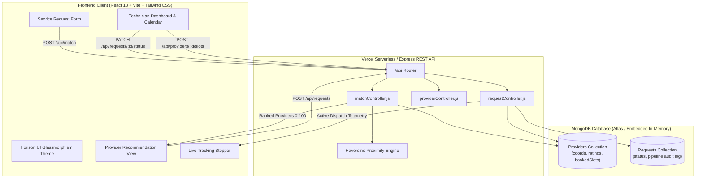
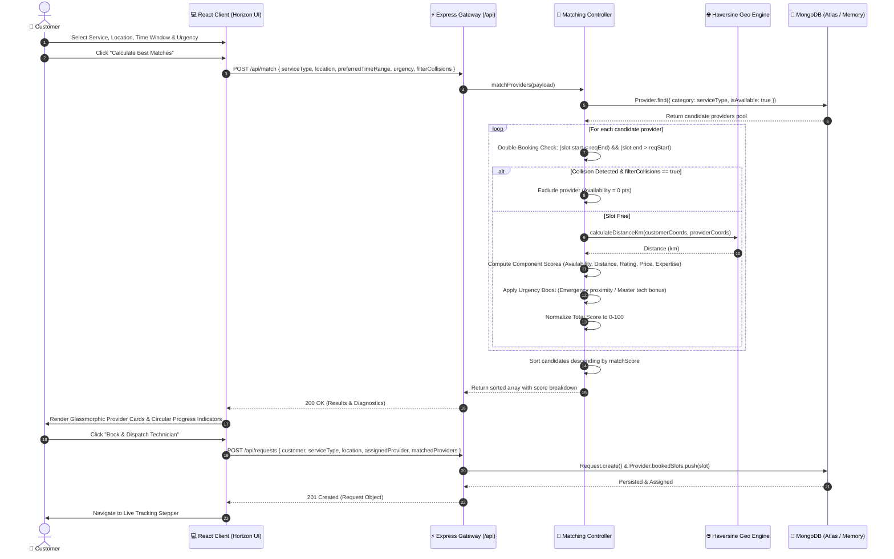
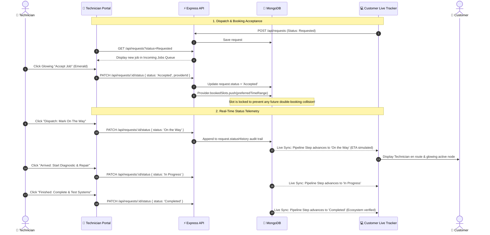

# OmniSync • Smart Home Service Automation MVP

> **8-Hour Hackathon Build** — A full-stack MERN application connecting smart homeowners with pre-vetted specialists using multi-factor algorithmic matching, collision-free scheduling, and live bidirectional job tracking.

Built with the **Horizon UI Glassmorphism** design system: rich emerald, teal, and slate color palettes, ambient gradient mesh backdrops, circular SVG progress meters, and responsive pipeline steppers.

---

## 📑 Table of Contents
1. [System Architecture & Data Flow](#-system-architecture)
2. [Sequence Diagrams](#-sequence-diagrams)
   - [Customer Dispatch & Matching Engine](#1-algorithmic-dispatch--matching-engine-sequence)
   - [Bidirectional Pipeline Lifecycle & Calendar Sync](#2-bidirectional-job-lifecycle--calendar-locking-sequence)
3. [Algorithmic Matching Engine & Normalization](#-core-matching-algorithm)
4. [Horizon UI Design System](#-horizon-ui-design-system)
5. [Vercel Deployment Guide](#-vercel-deployment-guide)
6. [Local Quick Start](#-local-quick-start)
7. [Automated Verification & Test Suites](#-automated-verification)
8. [Hackathon Demo Script](#-hackathon-demo-script-3-minute-walkthrough)

---

## 🏛️ System Architecture



---

## 🔄 Sequence Diagrams

### 1. Algorithmic Dispatch & Matching Engine Sequence

The following diagram details the customer request flow from form submission, candidate filtering, double-booking collision detection, multi-factor scoring, to database persistence:



---

### 2. Bidirectional Job Lifecycle & Calendar Locking Sequence

This sequence highlights the real-time operational synchronization between the customer dispatch pipeline and the technician portal:



---

## 🧮 Core Matching Algorithm

Located in [`server/controllers/matchController.js`](file:///d:/Code/Smart_Home_Automation/server/controllers/matchController.js):

### 1. Collision Prevention Formula
A candidate provider is deemed in conflict if any existing booked slot overlaps with the requested service window $[T_{\text{start}}, T_{\text{end}}]$:
$$\text{HasCollision} = \exists \text{ slot} \in \text{bookedSlots} : (\text{slot.start} < T_{\text{end}}) \land (\text{slot.end} > T_{\text{start}})$$

### 2. Multi-Factor Scoring Formula (Normalized to 0–100)
$$\text{Match Score} = \min\left(100, \max\left(0, \text{round}\left(S_{\text{avail}} + S_{\text{dist}} + S_{\text{rating}} + S_{\text{price}} + S_{\text{exp}} + S_{\text{urgency}}\right)\right)\right)$$

| Component | Max Pts | Mathematical Logic |
| :--- | :---: | :--- |
| **Availability ($S_{\text{avail}}$)** | **25** | 25 pts if completely open today; 20 pts if free in requested slot with adjacent bookings; 0 if colliding. |
| **Distance ($S_{\text{dist}}$)** | **25** | Haversine distance $d$ (km). If $d \le 2\text{ km} \rightarrow 25\text{ pts}$. If $2 < d < 30\text{ km} \rightarrow 25 \times \left(1 - \frac{d - 2}{28}\right)$. If $d \ge 30\text{ km} \rightarrow 0\text{ pts}$. |
| **Rating ($S_{\text{rating}}$)** | **20** | Rating $R \in [1.0, 5.0] \rightarrow \left(\frac{R}{5.0}\right) \times 20$. (e.g. 4.9 ★ = 19.6 pts). |
| **Price ($S_{\text{price}}$)** | **15** | $15 \times \left(1 - \frac{\text{price} - \text{minPrice}}{\text{maxPrice} - \text{minPrice}}\right)$ relative to the active category pricing pool. |
| **Expertise ($S_{\text{exp}}$)** | **15** | Master = 15 pts \| Expert = 12 pts \| Intermediate = 9 pts \| Beginner = 6 pts. |
| **Urgency Boost ($S_{\text{urgency}}$)** | **5** | If `urgency === 'Emergency'`: +3 pts for $d < 8\text{ km}$, +2 pts for Master/Expert qualification. |

---

## 💎 Horizon UI Design System

- **Color Hierarchy**:
  - Background: Deep Slate & Obsidian (`#070C18`, `#0B132B`)
  - Primary Accents: Vibrant Emerald (`#10B981`) and Deep Teal (`#14B8A6`)
  - Status Indicators: Emerald (Free/Online), Amber (Busy/Booked), Rose (Emergency/Decline)
- **Glassmorphic Utilities**:
  - `glass-panel`: `bg-slate-900/60 backdrop-blur-xl border border-white/10 shadow-2xl`
  - `glass-input`: `bg-[#0A1226]/60 border border-white/10 text-white backdrop-blur-md`
  - `glow-emerald`: `box-shadow: 0 0 25px -5px rgba(16, 185, 129, 0.5)`
- **Dynamic Data Visualization**:
  - SVG Circular Progress indicator with animated stroke dashoffset and glowing dropshadow.
  - Responsive horizontal and vertical pipeline steppers.

---

## 🚀 Vercel Deployment Guide

The project is fully pre-configured for **Vercel** full-stack deployment using Vercel Serverless Functions and Vite static hosting.

### Step 1: Push Code to GitHub
Ensure the latest code is on your repository `https://github.com/asnayem1122/Smart_Home_Automation_SaaS.git`.

### Step 2: Import into Vercel
1. Go to [vercel.com](https://vercel.com) and log in with GitHub.
2. Click **Add New...** $\rightarrow$ **Project**.
3. Select **`Smart_Home_Automation_SaaS`**.

### Option B: Standalone `/server` Backend Deployment (Framework: Other)
If deploying `/server` as an independent backend service on Vercel:
1. **Root Directory**: Set to `server`.
2. **Framework Preset**: Select **Other**.
3. **Build Command**: Leave empty / default.
4. **Output Directory**: Leave empty / default.
5. Vercel will detect [`server/vercel.json`](file:///d:/Code/Smart_Home_Automation/server/vercel.json) and compile using `@vercel/node`:
   ```json
   {
     "version": 2,
     "builds": [{ "src": "index.js", "use": "@vercel/node" }],
     "routes": [{ "src": "/(.*)", "dest": "index.js" }]
   }
   ```
6. **Environment Variables**: Add `MONGO_URI` (MongoDB Atlas) and `NODE_ENV=production`.
7. Once deployed, test your live endpoint at `https://<your-server-domain>.vercel.app/health`.

### Step 4: Environment Variables
Add the following in the Vercel Dashboard under **Environment Variables**:
| Key | Recommended Value | Notes |
| :--- | :--- | :--- |
| `MONGO_URI` | `mongodb+srv://<user>:<pass>@cluster.mongodb.net/smarthome?retryWrites=true&w=majority` | Free MongoDB Atlas connection string |
| `NODE_ENV` | `production` | Production mode |

> [!TIP]
> **Zero-Config Notice**: If `MONGO_URI` is omitted during preview, the backend includes auto-seeding and local fallback handlers. For persistent cross-invocation storage in production serverless, supply a free MongoDB Atlas connection string.

### How Vercel Routes Traffic (`vercel.json`)
```json
{
  "version": 2,
  "buildCommand": "npm run build",
  "outputDirectory": "client/dist",
  "rewrites": [
    { "source": "/api/(.*)", "destination": "/api/index.js" },
    { "source": "/(.*)", "destination": "/index.html" }
  ]
}
```
- Calls to `/api/*` trigger the serverless function wrapped in [`api/index.js`](file:///d:/Code/Smart_Home_Automation/api/index.js).
- All other routes serve the compiled React SPA with client-side routing.

---

## 💻 Local Quick Start

### Prerequisites
- Node.js v18+ & npm v9+

### 1. Clone and Install Dependencies
```bash
git clone https://github.com/asnayem1122/Smart_Home_Automation_SaaS.git
cd Smart_Home_Automation_SaaS

# Install server & client packages
cd server && npm install
cd ../client && npm install
cd ..
```

### 2. Run the Stack Locally
In Terminal 1 (Backend Server):
```bash
cd server
npm start
# 🚀 Running on http://localhost:5000 (auto-seeds 13 providers into in-memory MongoDB)
```

In Terminal 2 (Frontend Client):
```bash
cd client
npm run dev
# 💻 Running on http://localhost:3000 (proxies /api to port 5000)
```

---

## 🧪 Automated Verification

### Run Matching Engine Unit Tests
```bash
cd server
npm run test:match
```
**Test Results (10 / 10 PASS)**:
- Haversine Proximity Calculation: `PASS`
- Double-Booking Collision Prevention (4 boundary scenarios): `PASS`
- Multi-Factor Normalization (0–100): `PASS`

### Run End-to-End API Integration Tests
```bash
cd server
node test/test-api.js
```
**Test Results (PASS)**:
- `/api/health`: `200 OK`
- `/api/providers`: Loaded 13 providers
- `/api/match`: Ranked candidate with score 93/100
- `/api/requests`: Created and transitioned to `Accepted`

---

## 🎤 Hackathon Demo Script (3-Minute Walkthrough)

1. **Minute 1: The Problem & Matching Engine (Customer Flow)**
   - Open `http://localhost:3000`.
   - Select **HVAC & Climate Automation** with location set to **Downtown Austin**.
   - Select **Emergency Urgency** and keep **Strict Collision Prevention** active.
   - Click **"Calculate Best Matches & Rankings"**.
   - Show the judges the circular progress meter, ranking breakdown, and explain how providers with conflicting booked slots were automatically filtered.
2. **Minute 2: Dispatch & Live Telemetry Stepper**
   - Click **"Book & Dispatch Technician"**.
   - Show the 5-stage pipeline stepper with glowing emerald nodes.
   - Demonstrate the **Hackathon Stage Simulator** to advance the order in real time.
3. **Minute 3: Technician Portal & Calendar Synchronization (Provider Flow)**
   - Switch to the **Technician Portal** in the navigation bar.
   - Select the assigned provider from the persona dropdown.
   - Show the **Incoming Jobs Queue** with the glowing Accept/Decline actions.
   - Switch to the **Visual Calendar Timeline** to show that the booked appointment is now visually blocked out in amber.
   - Open **Active Job & Status Controls** and click **"Dispatch: Mark On The Way"** $\rightarrow$ switch back to Customer Live Tracker to verify instant synchronization!
